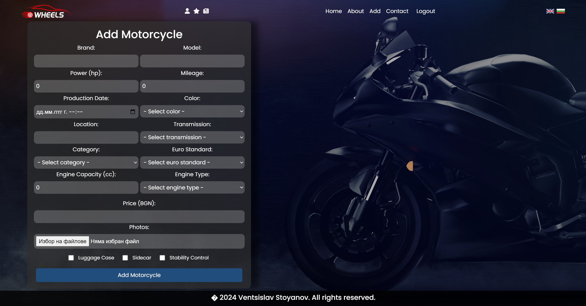

# SpeedyWheels - Spring MVC Application

<div align="center">
  <a href="https://github.com/VStoqnov7/SpeedyWheels">
    
  </a>
    <h2>SpeedyWheels</h2>
    <p>Deployed: <a href="https://speedywheels2-speedywheels2.azuremicroservices.io/">HERE</a></p>
</div>

# Installation

### Prerequisites:

- JDK 17
- Apache Maven 3.9.7 or higher

_To set up and run SpeedyWheels, you need to:_

Set up environment variables `${MYSQL_HOST}, ${MYSQL_PORT}, ${MYSQL_USER}, ${MYSQL_PASSWORD}, ${EMAIL_RECIPIENT}, ${ADMIN_USERNAME}, ${ADMIN_PASSWORD}`

```yaml
spring.datasource.url: jdbc:mysql://${MYSQL_HOST}:${MYSQL_PORT}/speedywheels?allowPublicKeyRetrieval=true&useSSL=false&createDatabaseIfNotExist=tru
spring.datasource.username: ${MYSQL_USER}
spring.datasource.password: ${MYSQL_PASSWORD}
email.recipient.address: ${EMAIL_RECIPIENT}
admin.username: ${ADMIN_USERNAME}
admin.password: ${ADMIN_PASSWORD}
```

# Built With

- 
- 
- 
- 
- 
- 
- 
- 
- 
- 

# Testing

- 
- 
- 
- 
- 

# Internalization/i18n

1. **`Bulgarian`**
2. **`English`**

# About The Project

_-Our platform is dedicated to connecting buyers and sellers in the automotive world. Whether you’re looking to buy or sell cars, motorcycles, or SUVs, SpeedyWheels offers an easy and efficient way to navigate the market.-_

### -Home-

_This is the home page accessible to all users, including those who are not registered. Users can switch between Bulgarian and English languages using the corresponding language flags._


<hr/>

### -About-

_This is the About page. It provides detailed information about our application and its features._


<hr/>

### -Contact-

_This page allows users to send a contact message to our support team. It includes a form that users must fill out with specific details. The form is validated to ensure that all required fields are completed correctly._

**Backend Validations:**

- **Full Name:** _Checks that the full name field is not blank._
- **Email:** _Validates that the email address provided is not blank and conforms to standard email format._
- **Subject:** _Ensures that the subject field is not left empty._
- **Message:** _Confirms that the message field is filled out._
- **Email Sending:** _The contact message will be sent to the designated recipient's email address, as specified in the configuration:_

```yaml
email.recipient.address: ${EMAIL_RECIPIENT}
```


<hr/>

### -Register-

_This page allows users to create a new account on our platform. The registration form includes several backend validations to ensure data integrity and security._

**Backend Validations:**

- **Username:** _Checks if the username is unique and not already registered on the platform. Usernames should be between 5 and 20 characters long._
- **Password:** _Ensures that the password and confirm password fields match and that they are between 3 and 20 characters long._
- **Unique:** _Verifies that the email address is unique and not already used. The email must follow the standard email format._
- **Name:** _Validates that both the first and last names are between 3 and 20 characters long._
- **Age:** _Ensures that the age provided is a positive number, with a minimum value of 1 year._
- **Picture:** _If a profile picture is uploaded, it must be a valid file and meet specified size requirements._
- **Picture Size:** _Checks that the uploaded profile picture does not exceed 10MB in size._


<hr/>

### -Login-

_This page allows users to log into their existing accounts on our platform. The login form includes backend validations to ensure the credentials provided are correct._

**Backend Validations:**

- **Username and Password:** _Verifies that both the username and password fields are correctly filled in. If the provided credentials do not match any registered account, an error message will notify the user of an authentication failure._


<hr/>

### -Login as Administrator-

_This is the page specifically designed for logged-in administrators. It serves as a central hub where admins can interact with various administrative features and manage platform settings._

_Only users with the Admin role can change other users' roles, ban them, and delete their accounts. This page lists all administrators and users, excluding the admin with the username specified as:_

```yaml
admin.username: ${ADMIN_USERNAME}
```


_You can add a car to your favorites if it is not your listing, and you can delete the car if it is your listing or if you are an admin._


<hr/>

### -Login as User-

_This is the Home page that logged-in users access upon successful authentication. It serves as a central hub where users can interact with various features and view personalized content based on their account and activities._

**This is the home page with no vehicles:**


**This is the home page with vehicles:**


### -Add Car-

_This page allows users to add a new car to the platform. The form includes several backend validations to ensure data integrity and security._

**Backend Validations:**

- **Brand:** _Ensures the brand field is not empty._
- **Model:** _Ensures the model field is not empty._
- **Power:** _Checks that the car's power is at least 1 HP._
- **Mileage:** _Validates that the mileage is a non-negative number._
- **Production Date:** _Ensures the production date is not empty and is in the past or present._
- **Color:** _Ensures the color field is not empty._
- **Location:** _Ensures the location field is not empty._
- **Transmission Type:** _Ensures the transmission type field is not empty._
- **Euro Standard:** _Ensures the euro standard field is not empty._
- **Cubic Capacity:** _Checks that the cubic capacity is at least 1._
- **Engine Type:** _Ensures the engine type field is not empty._
- **Price:** _Ensures the price is not empty and is at least 1._
- **Photos:** _Validates that at least one valid photo is uploaded._
- **Photos Size:** _Checks that each uploaded photo does not exceed 10MB_
- **Category:** _Ensures the car category field is not empty._


<hr/>

### -Add Motorcycle-

_This page allows users to add a new motorcycle to the platform. The form includes several backend validations to ensure data integrity and security._

**Backend Validations:**

- **Brand:** _Ensures the brand field is not empty._
- **Model:** _Ensures the model field is not empty._
- **Power:** _Checks that the motorcycle's power is at least 1 HP._
- **Mileage:** _Validates that the mileage is a non-negative number._
- **Production Date:** _Ensures the production date is not empty and is in the past or present._
- **Color:** _Ensures the color field is not empty._
- **Location:** _Ensures the location field is not empty._
- **Transmission Type:** _Ensures the transmission type field is not empty._
- **Euro Standard:** _Ensures the euro standard field is not empty._
- **Cubic Capacity:** _Checks that the cubic capacity is at least 1._
- **Engine Type:** _Ensures the engine type field is not empty._
- **Price:** _Ensures the price is not empty and is at least 1._
- **Photos:** _Validates that at least one valid photo is uploaded._
- **Photos Size:** _Checks that each uploaded photo does not exceed 10MB_
- **Category:** _Ensures the motorcycle category field is not empty._



<hr/>

### -Vehicle Showcase-

_This page showcases all vehicles that have been added to the platform. Vehicles and motorcycles are sorted by their addition date, ensuring that users can easily view the most recently added vehicles._


<hr/>

### -Motorcycle Showcase-

_This page displays all motorcycles that have been added to the platform. Motorcycles are sorted by their addition date, allowing users to easily view the most recently added motorcycles._


<hr/>

### -Jeep Showcase-

_This page presents all jeeps that have been added to the platform. Jeeps are sorted by their addition date, allowing users to view the most recently added jeeps first._


<hr/>

### -Car Showcase-

_This page displays all cars that have been added to the platform. Cars are sorted by their addition date, allowing users to easily view the most recently added cars._


<hr/>

### -Favorite Vehicles-

_This is the page you see when you have no favorite vehicles added._


_This is the page you see when you have favorite vehicles added. It showcases all the vehicles you have marked as favorites, sorted by their addition date._


<hr/>

### -My Vehicles-

_This is the page you see when you haven't added any vehicles yet._


_This page displays all the vehicles that you have added to the platform. The vehicles are listed and sorted by their addition date, allowing you to easily manage and review your own vehicles._


<hr/>

### -Vehicle Profile-

_This page provides detailed information about the selected vehicle. Here, you can view all the specifications and features of the vehicle, including its brand, model, production year, and more._

_Users can leave comments about the vehicle, providing feedback, asking questions, or sharing their experiences. This feature allows for interaction and engagement with the community, enabling users to contribute to discussions and reviews related to the vehicle._


<hr/>

### -User Profile-

_This page provides a detailed view of the user's profile. It displays essential information such as the user's first name, last name, contact phone, city, and social media links. The profile page incorporates backend validations when updating the first and last names to ensure they conform to specific length requirements (3 to 20 characters), thereby maintaining data integrity and consistency._

**Backend Validations:**

- **First Name:** _Ensures that the first name is between 3 and 20 characters long._
- **Last Name:** _Ensures that the last name is between 3 and 20 characters long._


<hr/>
